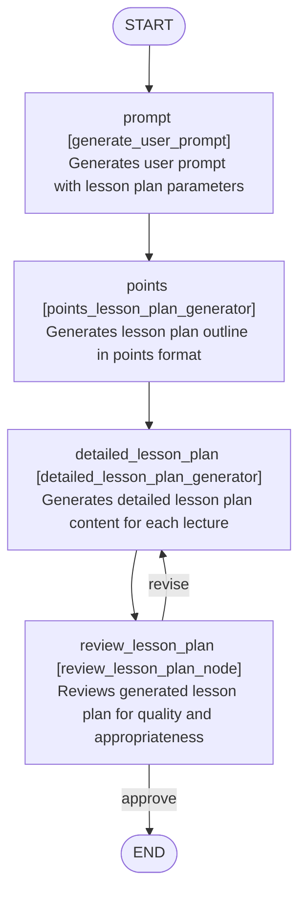

# SensAI

SensAI is an AI-first Learning Management System (LMS) enabling educators to teach smarter and reach further. SensAI coaches students through questions that develop deeper thinking—just like you would, but for every student and all the time.

This repository contains both backend (Python/FastAPI) and frontend (React) code for SensAI.

---

## Table of Contents

- [Features](#features)
- [Setup](#setup)
- [How It Works](#how-it-works)
- [Intelligent Lesson Plan & Assessment Workflows](#intelligent-lesson-plan--assessment-workflows)
- [API Overview](#api-overview)
- [Testing](#testing)

---

## Features

- **RAG-Enhanced Lesson Plan Generation:** Retrieval Augmented Generation (RAG) for context-aware, adaptive lesson plans.
- **Reading Level Estimation:** Automatically estimate student reading levels and tailor content accordingly.
- **Duplicate Detection:** Prevents content overlap using advanced prompting and structured input validation.
- **Structured Inputs:** All flows are designed to operate on well-defined, structured data, minimizing ambiguity.
- **LangGraph Structures:** The core logic is implemented via flexible graph-based workflows, enabling modular and extensible pipelines.
- **Parallel Execution:** Graph nodes can be executed in parallel, drastically reducing execution time for complex processes.

---

## Setup

### Backend (Python/FastAPI)

1. **Clone the repository**  
   ```bash
   git clone https://github.com/08sarthak/Hyperverge-Team-Error.git
   cd Hyperverge-Team-Error/sensai-ai
   ```

2. **Install dependencies**  
   ```bash
   pip install -r requirements.txt
   ```

3. **Environment variables**  
   - Copy `.env.example` to `.env` and fill in required settings (DB connection, API keys, etc.).

4. **Database setup**  
   - Set up your database as per the environment file.
   - Run migrations if available (see project docs for details).

5. **Run the backend server**  
   ```bash
   uvicorn src.api.main:app --reload
   ```
   The API will be available at `http://localhost:8000`.

### Frontend (React/Next.js)

See the `sensai-frontend` directory for complete instructions.  
Basic steps:
1. Ensure backend is running.
2. Install Node.js (if not already).
3. Clone and set up frontend:
   ```bash
   cd ../sensai-frontend
   npm ci
   cp .env.example .env.local
   # Edit .env.local as needed (Judge0 keys, OAuth, etc.)
   npm run dev
   ```
   App will be available at `http://localhost:3000`.

---

## How It Works

SensAI leverages advanced AI workflows, RAG, and graph-based orchestration to deliver individualized learning for every student and intelligent planning tools for educators.

### Educator Journey

Educators can create, review, and refine lesson plans using a variety of intelligent tools:

- `@router.post("/Lesson_Plan")`: Generate a lesson plan from the stored database, deriving study material from CBSE, ICSE, State Board, etc. portals  
  *(Route: see `sensai-ai/src/api/routes/lessonplan.py`)*

- `@router.post("/Lesson_Plan_from_Topic")`: Mainly focused on generating lesson plans from the study material provided by the educator, using RAG to transcribe the material and generate the lesson plan

- `@router.post("/Lesson_Plan_auto")`: (Future scope) A unified API that merges the above, simplifying and automating lesson planning.

- `@router.post("/review_lesson_plan")`: Automatically reviews generated lesson plans and triggers revisions if they do not meet quality, coverage, or personalization criteria.

### Student Journey

Students are guided through a two-part, adaptive assessment that culminates in a fully personalized lesson plan:

- `@router.post("/assessment")`:  
  Students provide basic info (class, board, subject, chapter number, etc.), which is stored in a unique thread per student.  
  *(Route: see `sensai-ai/src/api/routes/student.py`)*

- `@router.post("/assessment/continue")`:  
  The system continues the thread with 2–3 behavioral questions to understand learning styles, habits, and routines, followed by 10 chapter-specific questions to assess current understanding.
  Using these behavioral and academic insights, SensAI generates an optimal, individualized learning plan for each student.

---

## 🧠 Intelligent Lesson Plan & Assessment Workflows

SensAI supports two tightly integrated, AI-driven flows that power both personalized assessment and RAG-enhanced lesson plan generation.

### 1. Learner's Journey Graph

This workflow fetches educational content, conducts a conversational assessment using an LLM, processes the results, and generates a lesson plan precisely tailored to the learner’s needs.


**Node Details:**
- **fetch_content:** Loads educational content for the relevant thread.
- **bootstrap:** Injects the system prompt for assessment.
- **assess:** Conducts interactive, conversational assessment using LLM.
- **process_assessment:** Extracts actionable data and finalizes completion.
- **generate_plan:** Produces a personalized lesson plan based on all assessment results.

---

### 2. Educator's Journey Graph

This workflow utilizes Retrieval-Augmented Generation (RAG) for lesson planning, with quality checks and revisions for optimal results.



**Node Details:**
- **prompt:** Builds a detailed and structured prompt from all lesson parameters.
- **points:** Generates a lesson outline with RAG techniques.
- **detailed_lesson_plan:** Expands outline to detailed, lecture-wise content.
- **review_lesson_plan:** Reviews the output for accuracy, relevance, and quality, and triggers revision if needed.

---

### 🚀 Why SensAI's Approach is Unique

- **Truly Personalized:** Every plan is based on a blend of behavioral and academic data.
- **AI-Augmented:** Sophisticated prompting, reading level estimation, and duplicate detection are seamlessly integrated.
- **Flexible & Extensible:** Graph-based architecture (LangGraph) makes it easy to extend, customize, or parallelize steps for faster execution.
- **Quality Assurance:** Automated review and revision cycles ensure every lesson plan meets rigorous standards.

---

## API Overview

### Educator-Facing Endpoints
- `/lessonplan/` – Generate a lesson plan from a prompt.
- `/lessonplan/from-topic` – Generate a lesson plan based on a topic.
- `/lessonplan/auto` – (Planned) Unified lesson plan generation endpoint.
- `/lessonplan/review` – Review and revise a generated lesson plan.

*See: `sensai-ai/src/api/routes/lessonplan.py`*

### Student-Facing Endpoints
- `/student/assessment` – Initiate student assessment and store basic info.
- `/student/assessment/continue` – Continue assessment, ask behavioral and academic questions, and create a tailored learning plan.

*See: `sensai-ai/src/api/routes/student.py`*

---

## Testing

**Backend:**
```bash
pip install -r requirements-dev.txt
./run_tests.sh
# Coverage report: coverage_html/index.html
```

**Frontend:**
```bash
npm run test:ci
# (Optional) Upload coverage to Codecov
```
