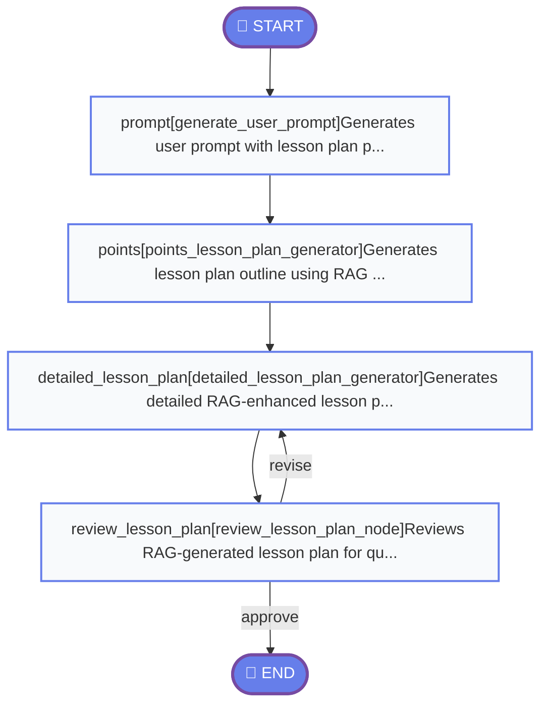

## RAG-Enhanced Lesson Plan Generation Graph

**File Location:** `app/utils_rag/graph_rag.py`  
**State Type:** `RagLessonPlanStateWithReview`

Enhanced workflow using RAG (Retrieval Augmented Generation) for lesson plan creation

### 🎯 Key Features

- RAG-enhanced content generation
- Topic-specific retrieval
- Enhanced web resource fetching
- Quality review and revision
- Structured output with RAG agents

### 📊 Graph Structure

### 🔧 Node Details

#### prompt
- **Function:** `generate_user_prompt`
- **Description:** Generates user prompt with lesson plan parameters including topic
- **Inputs:** `grade`, `subject`, `chapter_number`, `chapter_name`, `number_of_lecture`, `duration_of_lecture`, `class_strength`, `content`, `topic`
- **Outputs:** `user_prompt`

#### points
- **Function:** `points_lesson_plan_generator`
- **Description:** Generates lesson plan outline using RAG techniques
- **Inputs:** `user_prompt`
- **Outputs:** `lesson_plan_points`

#### detailed_lesson_plan
- **Function:** `detailed_lesson_plan_generator`
- **Description:** Generates detailed RAG-enhanced lesson plan content
- **Inputs:** `lesson_plan_points`, `number_of_lecture`, `structured_output`
- **Outputs:** `lesson_plan`, `revision_count`

#### review_lesson_plan
- **Function:** `review_lesson_plan_node`
- **Description:** Reviews RAG-generated lesson plan for quality
- **Inputs:** `lesson_plan`, `grade`, `subject`, `language`
- **Outputs:** `review_results`, `needs_revision`, `review_completed`

### 🔄 Flow Control

**Regular Edges:**
- `START` → `prompt`
- `prompt` → `points`
- `points` → `detailed_lesson_plan`
- `detailed_lesson_plan` → `review_lesson_plan`

**Conditional Edges:**
- **review_lesson_plan** (`should_revise_decision`):
  - `revise` → `detailed_lesson_plan`
  - `approve` → `END`
