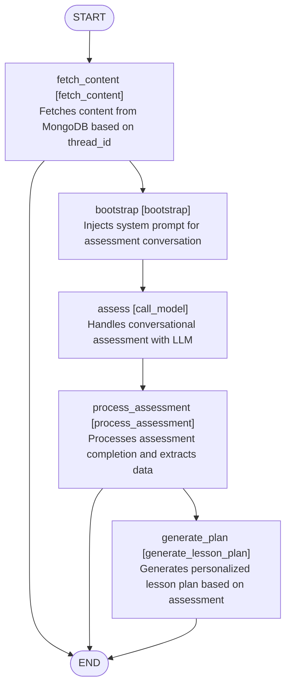

# SensAI

SensAI is an AI-first Learning Management System (LMS) enabling educators to teach smarter and reach further. SensAI coaches students through questions that develop deeper thinking—just like you would, but for every student and all the time.

This repository contains both backend (Python/FastAPI) and frontend (React) code for SensAI.

---

## Table of Contents

- [Features](#features)
- [Setup](#setup)
- [How It Works](#how-it-works)
- [Intelligent Lesson Plan & Assessment Workflows](#intelligent-lesson-plan--assessment-workflows)
- [Testing](#testing)
- [Contributing](#contributing)
- [Community](#community)
- [Documentation](#documentation)
- [License](#license)
- [Roadmap](#roadmap)

---

## Features

- AI-driven question coaching for deeper student thinking
- Personalized and RAG-enhanced lesson plan generation
- Topic-specific content retrieval with web resource integration
- Modular backend and frontend architecture for full LMS functionality
- Continuous integration with automated testing and coverage reporting
- Active roadmap and community feedback loop

---

## Setup

### Backend (Python/FastAPI)

1. **Clone the repository**  
   ```bash
   git clone https://github.com/08sarthak/Hyperverge-Team-Error.git
   cd Hyperverge-Team-Error/sensai-ai
   ```

2. **Install dependencies**  
   ```bash
   pip install -r requirements.txt
   ```

3. **Environment variables**  
   - Copy `.env.example` to `.env` and fill in required settings (DB connection, API keys, etc.).

4. **Database setup**  
   - Set up your database as per the environment file.
   - Run migrations if available (see project docs for details).

5. **Run the backend server**  
   ```bash
   uvicorn src.api.main:app --reload
   ```
   The API will be available at `http://localhost:8000`.

### Frontend (React/Next.js)

See the `sensai-frontend` directory for complete instructions.  
Basic steps:
1. Ensure backend is running.
2. Install Node.js (if not already).
3. Clone and set up frontend:
   ```bash
   cd ../sensai-frontend
   npm ci
   cp .env.example .env.local
   # Edit .env.local as needed (Judge0 keys, OAuth, etc.)
   npm run dev
   ```
   App will be available at `http://localhost:3000`.

---

## How It Works

### Backend

- Built with **FastAPI**, the backend serves RESTful endpoints for all core LMS and AI features.
- **Key modules/routes include:**
  - `/auth`: Authentication (sign-in, sign-up, JWT tokens, etc.)
  - `/users`, `/organizations`, `/cohorts`, `/courses`, `/milestones`, `/scorecards`, `/tasks`, `/lessonplan`, `/student`, etc.: User, organization, and educational content management.
  - `/ai` and `/chat`: AI-driven interactions, including question answering, chat coaching, and real-time feedback.
  - `/file`: File upload and download.
  - `/code`: Code execution and evaluation (uses Judge0 or similar).
- **AI Features:**  
  AI chat endpoints use modern language models to analyze student input and provide tailored feedback. The system can route tasks to different LLMs (e.g., GPT-4o for general, O3 for reasoning tasks).
- **RAG-Enhanced Lesson Plan Generation**  
  SensAI leverages Retrieval Augmented Generation (RAG) for lesson planning, combining topic-specific retrieval, web resource integration, and iterative review.

- **Middleware:**  
  - CORS enabled for frontend-backend interaction.
  - Bugsnag integration for error monitoring.
- **Testing:**  
  Uses `pytest` for API and logic testing. Run `./run_tests.sh` for full test and coverage report.

### Frontend

- Built with React (Next.js).
- Connects to backend for authentication, course/task management, and AI chat.
- Includes components like `LearningMaterialViewer`, interactive chat, and dashboards.

---

## 🧠 Intelligent Lesson Plan & Assessment Workflows

SensAI supports two tightly integrated, AI-driven flows that power both personalized assessment and RAG-enhanced lesson plan generation.

---

### 1. Personalized Assessment & Lesson Plan Generation

This workflow fetches educational content, runs a conversational assessment using an LLM, processes the results, and generates a lesson plan tailored to the learner’s needs.



**Node Details:**
- **fetch_content:** Loads educational content from MongoDB for a given thread.
- **bootstrap:** Injects a system prompt to prime the assessment conversation.
- **assess:** Uses an LLM for interactive, conversational assessment with the learner.
- **process_assessment:** Analyzes assessment outcomes and extracts actionable data.
- **generate_plan:** Uses assessment outcomes to create a personalized lesson plan.

---

### 2. RAG-Enhanced Lesson Plan Generation

This workflow combines Retrieval-Augmented Generation (RAG) for lesson planning with iterative review and revision for high-quality results.


**Node Details:**
- **prompt:** Crafts a comprehensive user prompt using parameters (grade, subject, topic, lectures, etc.)
- **points:** Generates a lesson plan outline using RAG techniques.
- **detailed_lesson_plan:** Produces detailed, lecture-wise lesson content, leveraging retrieved resources.
- **review_lesson_plan:** Reviews the lesson plan for completeness and quality; may trigger revision or approve and finish.

---

### 🚀 How These Workflows Empower SensAI

- **Personalized:** Every lesson plan is adapted based on real learner assessment.
- **AI-Augmented:** Conversational LLMs and RAG combine for deep reasoning and rich content generation.
- **Quality-First:** Automated review/revision ensures lesson plans are accurate and effective.
- **Modular:** Each step is a distinct, testable node for easier maintenance and extension.

For more technical details, see the implementation in `app/utils_rag/graph_rag.py` and the assessment modules.

---

## Testing

**Backend:**
```bash
pip install -r requirements-dev.txt
./run_tests.sh
# Coverage report: coverage_html/index.html
```

**Frontend:**
```bash
npm run test:ci
# (Optional) Upload coverage to Codecov
```

---

